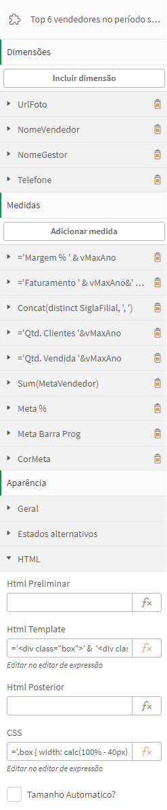
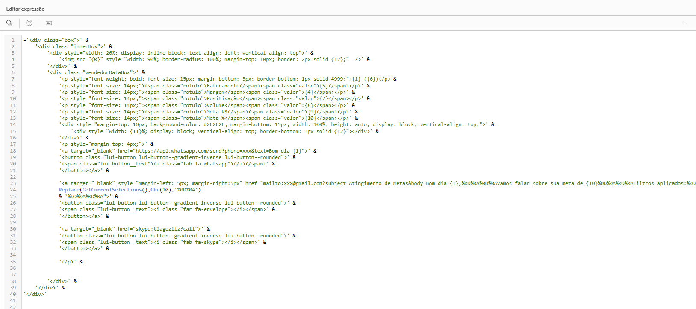

> 📄 This content is in Portuguese. For the English version, [click here](./readme.en.md).

# 🧩 Bilden HTML Render

**Bilden HTML Render** é uma extensão Qlik Sense que permite ao desenvolvedor definir um template HTML customizado para renderização de cada linha de dados do hipercubo. Ideal para a criação de visualizações livres, layouts criativos, componentes de UI personalizados ou mesmo integrações com bibliotecas externas de visualização, essa extensão oferece total controle sobre o conteúdo HTML gerado a partir dos dados. 

---

## ✨ Funcionalidades principais

- Renderização HTML por linha de dados (template por registro do hipercubo).
- Suporte a HTML personalizado antes, durante e após os dados.
- Inclusão de CSS customizado diretamente no `<head>`.
- Modo carrossel com animações e controle de tempo.
- Injeção customizada de JavaScript para lógica adicional.
- Acesso completo à Capability API do Qlik via `window.qlikObject`.
- Total compatibilidade com dimensões e medidas do modelo Qlik.

---

## 🛠️ Como funciona o template

Além das dimensões e medidas, a extensão utiliza **três blocos principais de HTML**  e **um bloco CSS** para montar o conteúdo final:

| Bloco              | Descrição |
|--------------------|-----------|
| **HTML Preliminar** | Renderizado **uma única vez** antes dos elementos de dados. Ideal para abertura de estruturas, como `<ul>`. |
| **HTML Template**   | Renderizado **uma vez para cada linha do hipercubo**. Usa placeholders por posição para referenciar dimensões e medidas. |
| **HTML Posterior**  | Renderizado **uma única vez** após os dados. Ideal para fechamento de estruturas, como `</ul>`. |
| **CSS**             | Seu conteúdo é encapsulado em uma tag `<style>` e anexado ao `<head>` da página. |




### 📌 Exemplo de uso básico

Suponha que você deseje criar uma lista HTML com nomes de clientes:

**HTML Preliminar**
```html
'<ul class="lista-clientes">'
```

**HTML Template**
```html
'<li>{0} - Compras: {3}</li>'
```

**HTML Posterior**
```html
'</ul>'
```

> 💡 Os placeholders `{0}`, `{1}`, `{2}`, etc., referenciam as **dimensões e medidas na ordem em que foram adicionadas**, sendo `{0}` a primeira dimensão, `{3}` a primeira medida (caso haja 3 dimensões antes).

---

## 🔠 Aspas, cifrões e limites

- Como os blocos HMTL esperam expressões textuais - começando e terminando com aspas simples (`'`)  - Use `Chr(39)` para representar aspas simples (`'`) e `Chr(36)` para o símbolo de cifrão (`$`) quando o conteúdo HTML necessitar desses caracteres. Consulte a tabela ASCII se precisar representar outros caracteres especiais.
- A extensão utiliza um hipercubo sem paginação, com limite de **10.000 células** visíveis. Se a combinação de linhas × colunas ultrapassar esse limite, **parte dos dados não será renderizada**, pois o Qlik não envia registros além desse volume. Uma dica para otimizar a utilização desse limite é gerar parte do conteúdo HTML nas dimensões ou medidas, combinando vários campos em um só.

---

## 🆓 Modo sem dados

A extensão pode ser utilizada **sem dados**, nesse modo os blocos **HTML Preliminar**, **HTML Template** e **HTML Posterior** são **concatenados e renderizados uma única vez** cada — sem repetição por linha de dados.

Esse modo é útil para incorporar conteúdos diretamente no painel do Qlik, como:

- Documentos
- Sites ou Formulários (desde que a origem permita o uso de `iframe`)
- Vídeos
- Injeção de CSS ou JS

---

## 🎠 Modo Carrossel

Quando a opção **"Tamanho automático"** é ativada, cada elemento ocupa **100% da área do componente**, criando um carrossel. Configurações disponíveis:

| Opção | Descrição |
|-------|-----------|
| **Exibir como carrossel** | Ativa ou desativa o modo carrossel. Caso desativado os itens são renderizados um abaixo do outro. |
| **Animar carrossel** | Alterna automaticamente os itens. |
| **Intervalo da animação** | Tempo de exibição de cada item (em ms). |
| **Velocidade da animação** | Duração da transição entre itens (em ms). |

---

## 🧪 Injeção de JS e acesso à Capability API

A extensão permite a injeção direta de JavaScript customizado. Além disso, a **Capability API do Qlik já está carregada** no objeto `window.qlikObject`, permitindo:

- Seleções em campos
- Atribuição de valores a variáveis.
- Navegação entre pastas.
- Execução de qualquer funcionalidade suportada pela API do Qlik.

Um exemplo de utilização muito comum nesse caso é utilizar uma função que, ao ser clicada, atribui um valor a uma variável e exibe um pop-up que incorpora outra aba do aplicativo. Nessa outra aba, todos os componentes dependem dessa variável. Essa estrutura permite criar, por exemplo, uma visão com uma grid de produtos, e ao clicar em um dos produtos uma visão de **detalhe de produto** é carregada no pop-up, exibindo apenas informações do produto selecionado.

---
## 🧑‍💻 Exemplos
> (todos os dados desses apps são fictícios!)

Dashboard Comercial:
- À esquerda uma listagem de produtos ordenados por faturamento, onde o hover no card apresenta mais informações, e o clique exibe um pop-up de detalhamento do produto
- No meio uma listagem dos vendedores com maiores margens. O hover apresenta mais informações e botões de ação (whatsapp, e-mail e Skype)
- À direita um carrossel com dados das filiais, que passa automaticamente a cada 5 segundos


Consulta de Colaboradores RH
- Listagem de funcionários de uma empresa, o clique em uma das fotos carrega o painel do funcionário em um pop-up (uma outra aba).
- Nessa outra aba o HTML Render foi utilizado para apresentar os treinamentos e promoções


---
## 📂 Instalação

### Para Qlik Cloud:
1. Acesse o **Management Console**.
2. Vá para **Extensions** e clique em **Add**.
3. Selecione o `.zip` da extensão e envie.

👉 Veja a [documentação oficial](https://help.qlik.com/pt-BR/cloud-services/Subsystems/Hub/Content/Sense_Hub/Admin/mc-extensions.htm).

### Para Qlik Sense On-Premise:
1. Acesse o **Qlik Management Console (QMC)**.
2. Vá em **Extensões > Importar**.
3. Selecione o `.zip` da extensão e clique em **Importar**.

👉 Veja a [documentação oficial](https://help.qlik.com/en-US/sense-admin/May2025/Subsystems/DeployAdministerQSE/Content/Sense_DeployAdminister/QSEoW/Administer_QSEoW/Managing_QSEoW/import-extensions.htm)

---

## 🛠 Desenvolvimento
Esta extensão foi desenvolvida utilizando o pacote [qExt](https://github.com/axisgroup/qExt), que facilita a criação, empacotamento e deploy de extensões para o Qlik Sense. A estrutura de pastas e scripts foi baseada no template oficial do qExt, e pode ser customizada conforme a necessidade.  
Mais informações: https://github.com/axisgroup/qExt

---

## 📎 Licença

MIT License © Rodrigo Martins / Bilden  
Fique à vontade para adaptar, melhorar e contribuir.

---

## 🙋‍♂️ Suporte & Contato

Problemas ou sugestões?  
Abra uma [issue aqui no GitHub](https://github.com/drigomed/bilden-htmlrender/issues) ou entre em contato:

- [LinkedIn - Rodrigo Martins](https://www.linkedin.com/in/drigomed)
- [https://bildennegocios.com/](https://bildennegocios.com/)
