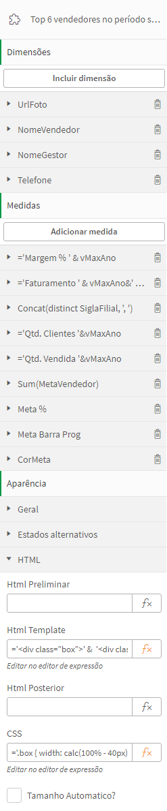

> 📄 Este conteúdo está em inglês. Para a versão em português, [clique aqui](./README.md).

# 🧩 Bilden HTML Render

**Bilden HTML Render** is a Qlik Sense extension that allows developers to define a custom HTML template to render each data row from the hypercube. Ideal for building freeform visualizations, creative layouts, custom UI components, or even integrations with external visualization libraries, this extension gives you full control over the HTML content generated from your data.

---

## ✨ Key Features

- HTML rendering per data row (template per hypercube record)
- Support for custom HTML before, during, and after the data
- Custom CSS injection directly into the `<head>`
- Carousel mode with animation and timing control
- JavaScript injection for custom behavior
- Full access to Qlik’s Capability API via `window.qlikObject`
- Fully compatible with dimensions and measures from the Qlik data model

---

## 🛠️ How the Template Works

In addition to dimensions and measures, the extension uses **three main HTML blocks** and **one CSS block** to compose the final output:

| Block            | Description |
|------------------|-------------|
| **HTML Pre**     | Rendered **once before** the data loop. Ideal for opening structures like `<ul>`. |
| **HTML Template**| Rendered **once per data row**. Uses positional placeholders to reference dimensions and measures. |
| **HTML Post**    | Rendered **once after** the data loop. Ideal for closing tags like `</ul>`. |
| **CSS**          | Injected into the page `<head>` inside a `<style>` tag. |

  


### 📌 Basic Example

Suppose you want to create an HTML list of customer names:

**HTML Pre**
```html
'<ul class="client-list">'
```

**HTML Template**
```html
'<li>{0} - Purchases: {3}</li>'
```

**HTML Post**
```html
'</ul>'
```

> 💡 Placeholders `{0}`, `{1}`, `{2}`, etc. refer to the **dimensions and measures in the order they were added**, with `{0}` being the first dimension and `{3}` the first measure (if three dimensions come first).

---

## 🔠 Quotes, Dollar Signs, and Limits

- Since HTML blocks are string expressions wrapped in single quotes (`'`), use `Chr(39)` to represent a single quote (`'`) and `Chr(36)` for the dollar sign (`$`) when needed. Refer to the ASCII table for other characters.
- The extension uses a non-paginated hypercube with a **10,000 visible cell limit**. If the row × column count exceeds this, **some data will not be rendered**, because Qlik does not pass additional records. A tip: pre-format HTML strings in dimensions/measures to optimize cell usage.

---

## 🆓 No Data Mode

The extension can be used in **no data mode**, where the **HTML Pre**, **HTML Template**, and **HTML Post** blocks are **rendered once each**, without looping through data rows.

This is useful for embedding external content into the Qlik panel, such as:

- Documents
- Forms or websites (if `iframe` is allowed)
- Videos
- Custom HTML, CSS, or JS

---

## 🎠 Carousel Mode

When the **Auto-size** option is enabled, each item takes up **100% of the component area**, forming a carousel. Available settings:

| Option                | Description |
|-----------------------|-------------|
| **Show as Carousel**  | Enables/disables carousel mode. If off, items stack vertically. |
| **Animate Carousel**  | Automatically rotates items. |
| **Animation Interval**| Time each item stays visible (in ms). |
| **Animation Speed**   | Transition duration between items (in ms). |

---

## 🧪 JS Injection & Qlik Capability API

This extension supports direct JavaScript injection. The **Qlik Capability API** is preloaded via `window.qlikObject`, allowing:

- Field selections
- Variable assignments
- Sheet navigation
- Any supported API operation

A common use case is a product grid where clicking a product assigns a variable and shows a popup. That popup displays another sheet filtered by that variable — useful for detailed drill-down views.

---

## 🧑‍💻 Examples  
> (All data shown is fictitious!)

**Sales Dashboard**  
- Left: product list sorted by revenue; hover shows details, click opens product popup  
- Center: top sellers with action buttons (WhatsApp, email, Skype)  
- Right: auto-playing branch performance carousel every 5 seconds  


**HR Dashboard**  
- Employee photo list; clicking a photo opens a profile popup (another sheet)  
- The profile uses HTML Render to display training and promotion history  


---

## 📂 Installation

### For Qlik Cloud:
1. Go to the **Management Console**
2. Navigate to **Extensions** and click **Add**
3. Upload the `.zip` file for the extension

👉 [Official Docs](https://help.qlik.com/en-US/cloud-services/Subsystems/Hub/Content/Sense_Hub/Admin/mc-extensions.htm)

### For Qlik Sense On-Premise:
1. Go to the **Qlik Management Console (QMC)**
2. Under **Extensions**, click **Import**
3. Upload the `.zip` file

👉 [Official Docs](https://help.qlik.com/en-US/sense-admin/May2025/Subsystems/DeployAdministerQSE/Content/Sense_DeployAdminister/QSEoW/Administer_QSEoW/Managing_QSEoW/import-extensions.htm)

---

## 🛠 Development

This extension was built using the [qExt](https://github.com/axisgroup/qExt) package, which simplifies the development, packaging, and deployment of Qlik Sense extensions. The folder structure and scripts are based on the official qExt template, and can be customized as needed.  
More info: https://github.com/axisgroup/qExt

---

## 📎 License

MIT License © Rodrigo Martins / Bilden  
Feel free to adapt, improve, and contribute.

---

## 🙋‍♂️ Support & Contact

Have feedback or issues?  
Open an [issue on GitHub](https://github.com/drigomed/bilden-htmlrender/issues) or contact me:

- [LinkedIn - Rodrigo Martins](https://www.linkedin.com/in/drigomed)  
- [https://bildennegocios.com/](https://bildennegocios.com/)

